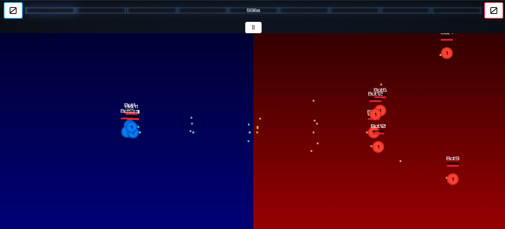

# 2D Multiplayer Games

This project hosts a small collection of local multiplayer experiments written in **Node.js** using **Express** and **Socket.IO**. The first game, **Space Battle Pong**, is fully playable while the remaining entries are placeholders for future ideas.

- **Author:** Charalampos
- **GitHub:** [charavant](https://github.com/charavant)
- **Email:** charavant@gmail.com

## Getting Started

1. Install dependencies if needed:
   ```bash
   npm install
   ```
2. Launch the server:
   ```bash
   node server.js
   ```
3. Open your browser to [http://localhost:3000](http://localhost:3000).

## Playing the Games

From the home screen you will see four tiles. Clicking a tile opens the PC view for that game. The PC page displays a QR code that mobile players can scan to join.

### Space Battle Pong
1. Click **Space Battle** on the home screen.
2. Click **Start Game** to reveal the QR code.
3. Scan the QR code or visit `/space-battle/controller` on a phone to join.
4. Choose a team and press **Start** on the mobile controller.

### Game 2, Game 3 and Game 4
These are currently under construction. You can still click their tiles to view the placeholder PC screens and QR codes.

## Screenshots
Below are example screenshots located in the `public/images` folder:




Feel free to explore and modify the code. Feedback is welcome!

## Testing Balancing

Run a quick simulation of a 120 second bot-only battle to evaluate balance tweaks:

```bash
npm run sim-battle
```

The script prints the levels reached by the bots, total experience earned, a histogram of DPS values and the peak bullet count observed during the run.

Balance values are stored in `src/data/balanceSettings.json`. The server and
the simulation will create this file with default values if it does not exist
and then load the settings from it on every run.
